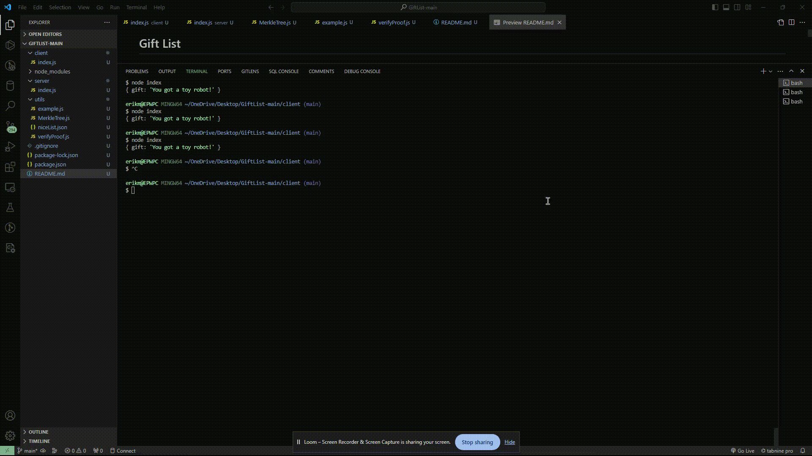

# Gift List

Welcome to the Gift List repository! Here's a quick guide on how to set it up and understand its structure.

## Initial Setup

- Clone the Repository: Start by cloning this repository to your local machine.
- Install Dependencies: Navigate to the root directory of the project and run npm install. This command installs all the necessary dependencies for the project.

## Repository Structure

### Client

- Purpose: The client acts as the prover. Its main role is to prove to the server that a certain name is included in the server's MERKLE_ROOT.
- Running the Client: Execute node client/index from the top-level directory. This script makes an HTTP request to the server with the necessary proof.

### Server

- Purpose: The server functions as the verifier. It confirms whether the name sent by the client is present in the MERKLE_ROOT. If the verification is successful, a gift is sent.
- Running the Server: Launch the server by running node server/index from the top-level directory. The server, an Express application, listens on port 1225 and handles requests from the client

### Utils

There are a few files in utils:

- The `niceList.json` which contains all the names of the people who deserve a gift this year (this is randomly generated, feel free to add yourself and others to this list!)
- The `example.js` script shows how we can generate a root, generate a proof and verify that some value is in the root using the proof. Try it out from the top-level folder with `node/example.js`
- The `MerkleTree.js` should look familiar from the Merkle Tree module! This one has been modified so you should not have to deal with any crypto type conversion. You can import this in your client/server
- The `verifyProof.js` should also look familiar. This was the last stage in the module. You can use this function to prove a name is in the merkle root, as show in the example.

## Demo

This guide should help you get started with the Gift List project. Happy coding, and may your name be on the nice list! 🎁🌲
